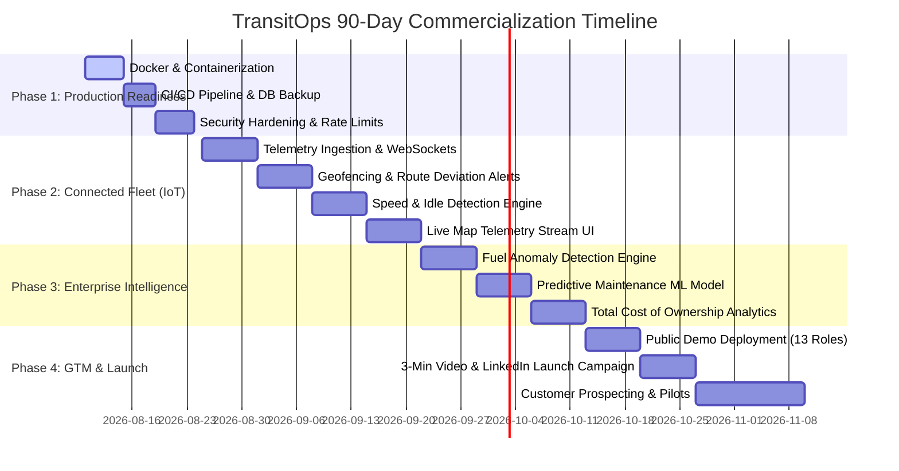

# 🚀 TransitOps 90-Day Master Roadmap: Prototype to Commercial Enterprise SaaS

> **Executive Summary**: TransitOps has crossed the threshold from an engineering prototype to a production-grade Transportation Operations Platform (~85% overall maturity). This 90-day execution roadmap outlines the exact path to bridge the remaining 15%, establishing production readiness, IoT connected fleet streams, enterprise intelligence, and commercial Go-To-Market (GTM) execution.

---

## 📊 Platform Maturity Matrix

| Module / Pillar | Current Status | Target Completion (Day 90) | Key Deliverables |
| :--- | :---: | :---: | :--- |
| **Fleet ERP Core** | ✅ 100% | 100% | Vehicle 360, Driver 360, Maintenance, Fuel, Vendors, Odometer |
| **Dispatch & Control Tower** | ✅ 100% | 100% | Queues, KPIs, Pessimistic Locking, Multithreaded Contention |
| **Vehicle Recommendation** | ✅ 100% | 100% | Multi-factor ranking, Capacity fit, Driver hours, Health deduction |
| **Routing & Multi-Stop ETA** | ✅ 100% | 100% | OSRM / Google Maps / Haversine fallback, Stop-by-stop ETAs |
| **Proof of Delivery (POD)** | ✅ 100% | 100% | Digital signature, Photo proof, GPS geofence validation |
| **Event-Driven Audit Trail** | ✅ 100% | 100% | Chronological lifecycle timeline (`JOB_CREATED` → `DELIVERED`) |
| **Milestone 1: Production Readiness** | 🛠️ 30% | 🎯 Day 14 | Docker Compose, GitHub Actions CI/CD, Structlog, Sentry, Rate Limiting |
| **Milestone 2: Connected Fleet (IoT)** | ⏳ 10% | 🎯 Day 45 | Live GPS Telemetry WebSockets, Geofence alerts, Speed & Idle events |
| **Milestone 3: Enterprise Intelligence**| ⏳ 15% | 🎯 Day 75 | Predictive Maintenance, Fuel Anomaly Engine, TCO Analytics |
| **Go-To-Market & Commercialization** | ⏳ 0% | 🎯 Day 90 | Public Interactive Demo, 13 Demo Personas, Pricing Tiers, GTM Launch |

---

## 🗓️ 90-Day Weekly Execution Plan



---

## 🛠️ Phase 1: Production Readiness (Days 1–14)

### Week 1: Infrastructure Containerization & CI/CD
- **Deliverables**:
  - `Dockerfile` for FastAPI Backend (multistage build, non-root user execution).
  - `Dockerfile` for Vite Frontend (Nginx static serving with gzip/brotli compression).
  - `docker-compose.production.yml`: PostgreSQL + Redis + Backend + Nginx reverse proxy + Certbot TLS.
  - `.github/workflows/ci-cd.yml`: Automated testing, linting, security audit (`pip-audit`, `npm audit`), and Docker image build on every PR.

### Week 2: Reliability, Observability & Security Hardening
- **Deliverables**:
  - **Structured Logging**: Migrate standard logging to `structlog` emitting JSON with correlation IDs (`x-request-id`).
  - **Error Tracking**: Sentry SDK integration for Python FastAPI & React SPA.
  - **Rate Limiting**: Redis-backed `slowapi` rate limiting on auth and API endpoints.
  - **Database Management**: Automated daily PostgreSQL backup script to S3/Cloud Storage with 30-day retention & automated point-in-time recovery test script.
  - **Security Auditing**: CORS whitelist enforcement, Content Security Policy (CSP) headers, OWASP ZAP automated scan.

---

## 📡 Phase 2: Connected Fleet Telemetry & IoT (Days 15–45)

### Weeks 3–4: Telemetry Ingestion & Real-Time Streams
- **Deliverables**:
  - `POST /api/v1/telemetry/ingest`: High-throughput batch GPS & vehicle sensor ingestion API (supports Teltonika, Concox, and custom OBD-II dongles).
  - WebSocket Server (`/ws/fleet/live`): Pushes live vehicle positions, speeds, heading, and battery voltages to the frontend at sub-second latency.
  - Redis Pub/Sub backend for horizontal scaling across multiple API workers.

### Weeks 5–6: Operational Event Engines & Alerts
- **Deliverables**:
  - **Geofencing & Polygon Engine**: Instant alerts when a vehicle enters or exits customer depots or restricted zones.
  - **Route Deviation Alerts**: Triggered if actual GPS position strays >500m from the `RoutingService` polyline geometry.
  - **Safety Events Engine**: Harsh braking, sudden acceleration, over-speeding, and prolonged idling (>15 mins with engine running).
  - Integrates directly into the `AuditEventService` as real-time `TELEMETRY_ALERT` events.

---

## 🧠 Phase 3: Enterprise Intelligence & Analytics (Days 46–75)

### Weeks 7–8: Financial & Health Analytics
- **Deliverables**:
  - **Fuel Anomaly Engine**: Detects sudden fuel level drops (theft detection) or discrepancy between fuel card purchase receipts and actual tank capacity.
  - **Fleet Health Score Engine**: Algorithmic 0–100 rating per vehicle combining fault codes (DTCs), maintenance overdue status, and driver wear-and-tear score.
  - **Total Cost of Ownership (TCO) Dashboard**: Aggregates Depreciation + Fuel + Maintenance + Insurance + Driver Salary per kilometer driven ($/km).

### Weeks 9–10: Predictive Maintenance & Recommendation AI
- **Deliverables**:
  - **Predictive Wear Modeling**: Forecasts brake pad, tire, and oil change intervals based on operating hours and load factors.
  - **AI Fleet Optimization**: Daily automated recommendations (e.g., *"Shift Vehicle TRK-04 to regional routes to balance mileage wear"*).

---

## 🎯 Phase 4: Commercialization & GTM (Days 76–90)

### Week 11: Public Interactive Demo Deployment
- **Deliverables**:
  - Hosted public demo instance on Cloud Infrastructure (AWS / GCP / Hetzner).
  - **13 Pre-Configured Personas** accessible via 1-click Quick Login:
    1. System Administrator
    2. Fleet Operations Director
    3. Dispatch Manager
    4. Safety & Compliance Officer
    5. Maintenance Manager
    6. Fleet Technician
    7. Warehouse Manager
    8. Regional Driver Lead
    9. Commercial Driver
    10. Billing & Invoicing Specialist
    11. Customer Support Agent
    12. Procurement Officer
    13. Read-Only Auditor / Executive
  - **Live Trip Simulator Script**: Background daemon generating realistic vehicle GPS movements on active trips in real time.

### Week 12: Go-To-Market Campaign & Outreach
- **Deliverables**:
  - **3-Minute Product Walkthrough Video**: Highlighting end-to-end flow: Order Creation → Intelligent Dispatch → Route Optimization → Driver Mobile POD → Event Audit Trail.
  - **Commercial SaaS Tiering Structure**:
    - **Starter ($15/vehicle/mo)**: Vehicle 360, Basic Dispatch, Maintenance & Fuel Tracking.
    - **Professional ($29/vehicle/mo)**: Routing Adapters, Digital POD, Telemetry Ingestion, Audit Trail.
    - **Enterprise ($49/vehicle/mo)**: Predictive Maintenance, Custom ERP Integration, Dedicated SLA.
  - **LinkedIn Launch Post Blueprint**: High-converting founder update focusing on operational engineering value.

---

## 📢 Commercial Launch Blueprint (LinkedIn Post Template)

```markdown
🚛 I built a Connected Transportation Operations Platform engineered for real-world logistics friction.

Most fleet software is just a static database. TransitOps is an active operational engine that manages the entire delivery lifecycle:

📦 Customer Order Creation → 🤖 Intelligent Multi-Factor Dispatch → 🗺️ Road-Network Routing & ETA → 📱 Digital Proof of Delivery → ⏱️ Immutable Event Audit Trail → 📈 Real-Time Fleet Analytics

Key Engineering Highlights:
⚡ Concurrency Prevention: Pessimistic DB locking under high-frequency multithreaded dispatch.
📍 Multi-Adapter Routing: Real-time OSRM & Google Maps fallback with stop-by-stop ETAs.
📸 Geofenced Digital POD: Base64 signature capture + 500m GPS proximity audit validation.
📜 Audit Stream: Chronological event stream tracking every state transition across jobs, trips, and vehicles.
🧪 Verification: 14/14 automated test suites passing in 3.4s, 100% clean production build.

Check out the interactive live demo (13 role-based login personas configured):
🔗 Demo: https://demo.transitops.io
💻 Codebase: https://github.com/ayus1234/transitops-odoo-hackathon-2026

If you run a fleet, logistics company, or field operations team:
👉 What is the single biggest operational bottleneck your current software fails to solve?

#FleetManagement #LogisticsTech #Python #FastAPI #React #SoftwareArchitecture #OpenSource
```

---

## ✅ Immediate Action Items (Next 48 Hours)

1. **Commit `ROADMAP_90_DAY.md`** to the repository root.
2. **Initialize Phase 1 Containerization**:
   - Create `backend/Dockerfile` and `frontend/Dockerfile`.
   - Configure `docker-compose.production.yml`.
3. **Set up GitHub Actions CI/CD pipeline** for automated testing on push.
